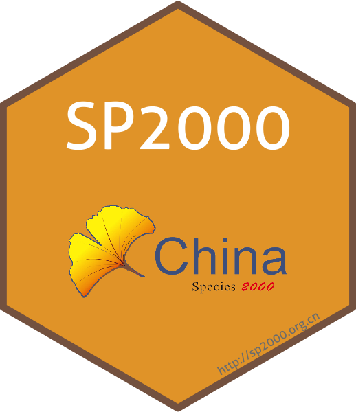

<!-- README.md is generated from README.Rmd. Please edit that file -->

## SP2000 

[](https://cran.r-project.org/package=SP2000)
[](https://badge.fury.io/for/gh/Otoliths/sp2000)
[](https://travis-ci.org/easystats/sp2000)
[](https://github.com/Otoliths/sp2000/actions)
[](https://github.com/Otoliths/sp2000/actions?query=workflow%3ACI)
[](http://www.rdocumentation.org/packages/SP2000)

<!-- r badge_devel("Otoliths/sp2000", "blue") -->
[](https://cran.r-project.org/package=SP2000)
[](https://cranlogs.r-pkg.org/downloads/total/last-month/SP2000)
[](https://cranlogs.r-pkg.org/downloads/total/last-week/SP2000)


This [**SP2000**](https://cran.r-project.org/package=SP2000) package programatically download catalogue of the Chinese known species of animals, plants, fungi and micro-organisms. There are __106509__ species & infraspecific taxa in [2019 Annual Checklist of Catalogue of Life China](http://sp2000.org.cn/2019), including __94260__ species and __12249__ infraspecific taxa.This package also supports access to catalogue of life global <http://catalogueoflife.org> and catalogue of life Taiwan <http://taibnet.sinica.edu.tw/home_eng.php?>.


## Overview 

[](https://gitee.com/LiuyongDing/latest_literature/raw/master/bad.png)
[](https://gitee.com/LiuyongDing/latest_literature/raw/master/img.png)

[**Species 2000**](http://sp2000.org.cn) China node is a regional node of the international species 2000 project, proposed by the international species 2000 Secretariat in October 20, 2006, was officially launched in February 7, 2006. Chinese Academy of Sciences, biological diversity Committee (BC-CAS), together with its partners, to support and manage the construction of species 2000 China node. The main task of the species 2000 China node, according to the species 2000 standard data format, the classification information of the distribution in China of all species to finish and check, the establishment and maintenance of Chinese biological species list, to provide free services to users around the world.


## Installation

### Current official release:
```r
install.packages("SP2000")
```

### Current beta / GitHub release:

Installation using R package
[**devtools**](https://cran.r-project.org/package=devtools):
```r
if (!requireNamespace("devtools", quietly=TRUE))
    install.packages("devtools")
    
devtools::install_github("Otoliths/sp2000")

```

## Usage

##### Note: You need to apply for the [*apiKey*](http://sp2000.org.cn/api/document) to run search_* functions of this package.

Load the **SP2000** package
```r
library(SP2000)
```
###### Search family IDs via family name, supports Latin and Chinese names
```r
set_search_key <- "your apiKey"
search_familyID(query = "Cyprinidae")
```
```r
#last Update: 2020-03-17
# A tibble: 1 x 3
#   family     familyIDs                        download.date
#   <chr>      <chr>                            <date>       
# 1 Cyprinidae bf72e220caf04592a68c025fc5c2bfb7 2020-03-17   
```
```r
queries <- c("Rosaceae","Cyprinidae")
search_familyID(query = queries)
```
```r
# last Update: 2020-03-17
# |======================================================================================| 100%, Elapsed 00:00
# A tibble: 2 x 4
#   family     familyIDs                        mc.cores download.date
#   <chr>      <chr>                               <dbl> <date>       
# 1 Rosaceae   F20171000000279                         2 2020-03-17   
# 2 Cyprinidae bf72e220caf04592a68c025fc5c2bfb7        2 2020-03-17   
```
###### Search taxon IDs via familyID ,scientificName and commonName
```r
search_taxonID(query = "Uncia uncia",name = "scientificName")
```
```r
# last Update: 2020-03-17
# A tibble: 1 x 3
#    scientificName taxonIDs                             download.date
#     <chr>          <chr>                                <date>       
#   1 Uncia uncia    b8c6a086-3d28-4876-8e8a-ca96e667768d 2020-03-17  
```
```r
queries <- c("Anguilla marmorata","Uncia uncia")
search_taxonID(query = queries,name = "scientificName")
```
```r
# last Update: 2020-03-17
# |======================================================================================| 100%, Elapsed 00:01
# A tibble: 2 x 3
#   scientificName     taxonIDs                             download.date
#   <chr>              <chr>                                <date>       
# 1 Anguilla marmorata e192fbc15df24049bcd0fd01d307affa     2020-03-17   
# 2 Uncia uncia        b8c6a086-3d28-4876-8e8a-ca96e667768d 2020-03-17  
```
```r
search_taxonID(query = "bf72e220caf04592a68c025fc5c2bfb7",name = "familyID")
```
```r
# last Update: 2020-03-17
# A tibble: 699 x 3
#   familyID                         taxonIDs                         download.date
#   <chr>                            <chr>                            <date>       
#1 bf72e220caf04592a68c025fc5c2bfb7 0019772b1f8f425f991eaa1b6faa0267 2020-03-17   
#2 bf72e220caf04592a68c025fc5c2bfb7 002336a9094e46ad89611a712d4cbffd 2020-03-17   
#3 bf72e220caf04592a68c025fc5c2bfb7 00f331f1289e43cfb51e19a1843c5b3d 2020-03-17   
#4 bf72e220caf04592a68c025fc5c2bfb7 0105aa416e95405d807984f504addae4 2020-03-17   
#5 bf72e220caf04592a68c025fc5c2bfb7 010ad956e57e4a489f79e11faf38d473 2020-03-17   
#6 bf72e220caf04592a68c025fc5c2bfb7 01607832b13743c8b41a25dfb6406b0b 2020-03-17   
#7 bf72e220caf04592a68c025fc5c2bfb7 01ec56a6ea8a44bf8dbc6aa1655aa875 2020-03-17   
#8 bf72e220caf04592a68c025fc5c2bfb7 02d92b0d50884da5a3a7c78db34ce09c 2020-03-17   
#9 bf72e220caf04592a68c025fc5c2bfb7 0323c94f48134445a7bd3c44c0b40227 2020-03-17   
#10 bf72e220caf04592a68c025fc5c2bfb7 032523c4852d406f8cd93fd8621b4676 2020-03-17   
# … with 689 more rows
```
###### Download detailed lists via species or infraspecies ID
```r
queries <- c("025397f9-9891-40a7-b90b-5a61f9c7b597","04c59ee8-4b48-4095-be0d-663485463f21",
           "4c539380-8d0a-4cbf-b612-1e6df5850295","522c1cfd-0d2c-490f-b8f8-0c7459f6dba5",
           "6d04dcf5-f390-472d-b674-4f09e43713ed","89c29448-a48f-46cb-a573-ee51dd47e7b0",
           "a3452c0c-6d75-465b-b110-537e4ac15f80","a69df232-07e4-4f06-9651-a4e52796f01a",
           "b8c6a086-3d28-4876-8e8a-ca96e667768d","c1dbe9f7-e02f-4f05-a1ca-1487a41075bd",
           "d5938c75-e51a-4737-aaef-4f342fa8b364","f95f766f-7b96-464a-bff5-43b1adafcf50",
           "faaf346f-49f4-400a-947b-edb6b0f6bd5e")           
x2 <- search_checklist(query = queries)
```
```r
# last Update: 2020-03-17
# |======================================================================================| 100%, Elapsed 00:02
```
###### Checklist lists convert data frame
```r
x3 <- list_df(x2)
head(x3)
```
```r
# A tibble: 6 x 19
#   ScientificName[… Synonyms chineseName[,1] CommonNames Kingdom[,1] Phylum[,1] Class[,1] Order[,1] Family[,1]
#   <chr>            <list>   <chr>           <list>      <chr>       <chr>      <chr>     <chr>     <chr>     
#1 Pardofelis marm… <df[,2]… 云猫            <chr [4]>   Animalia    Chordata   Mammalia  CARNIVORA Felidae   
#2 Felis bietiMiln… <df[,2]… 漠猫            <chr [5]>   Animalia    Chordata   Mammalia  CARNIVORA Felidae   
#3 Panthera tigris… <df[,2]… 虎              <chr [6]>   Animalia    Chordata   Mammalia  CARNIVORA Felidae   
#4 Prionailurus be… <df[,2]… 豹猫            <chr [9]>   Animalia    Chordata   Mammalia  CARNIVORA Felidae   
#5 Neofelis nebulo… <df[,2]… 云豹            <chr [6]>   Animalia    Chordata   Mammalia  CARNIVORA Felidae   
#6 Catopuma temmin… <df[,2]… 金猫            <chr [6]>   Animalia    Chordata   Mammalia  CARNIVORA Felidae   
#… with 10 more variables: Genus[,1] <chr>, Species[,1] <chr>, Infraspecies[,1] <chr>,
#   Distribution[,1] <chr>, Name[,1] <chr>, Email[,1] <chr>, Address[,1] <chr>, Institution[,1] <chr>,
#   References <list>, Downloaddate <date>
```

###### Get Catalogue of Life Global checklist via species name and id
```r
dbentry1 <- get_CoLGlobal(query = "4fdb38d6220462049eab9e3f285144e0", option = "id")
str(dbentry1)
```
```r
List of 9
 $ id                        : chr "4fdb38d6220462049eab9e3f285144e0"
 $ name                      : chr ""
 $ total_number_of_results   : int 1
 $ number_of_results_returned: int 1
 $ start                     : int 0
 $ error_message             : chr ""
 $ version                   : chr "1.9 rev 2126ab0"
 $ rank                      : chr ""
 $ results                   :'data.frame':	1 obs. of  12 variables:
  ..$ id                    : chr "4fdb38d6220462049eab9e3f285144e0"
  ..$ name                  : chr "Larus fuscus"
  ..$ rank                  : chr "Species"
  ..$ name_status           : chr "accepted name"
  ..$ record_scrutiny_date  :List of 1
  .. ..$ : list()
  ..$ online_resource       : chr "http://www.itis.gov/servlet/SingleRpt/SingleRpt?search_topic=TSN&search_value=176821"
  ..$ is_extinct            : chr "false"
  ..$ source_database       : chr "ITIS Selected: The Integrated Taxonomic Information System"
  ..$ source_database_url   : chr ""
  ..$ bibliographic_citation: chr "Tom Orrell (custodian); Dave Nicolson (ed). (2020). ITIS Selected: The Integrated Taxonomic Information System "| __truncated__
  ..$ name_html             : chr "<i>Larus fuscus</i> Linnaeus, 1758"
  ..$ url                   : chr "http://www.catalogueoflife.org/col/details/species/id/4fdb38d6220462049eab9e3f285144e0"
```

###### Find synonyms via species name from Catalogue of Life Global
```r
find_Synonyms("Anguilla anguilla")
```
```r
last Update: 2020-05-13
Find the results of synonyms for Anguilla anguilla are as follows: 
 [1] "Angill angill"                    "Anguilla acutirostris"            "Anguilla aegyptiaca"             
 [4] "Anguilla altirostris"             "Anguilla ancidda"                 "Anguilla anguilla macrocephala"  
 [7] "Anguilla anguilla mucrocephala"   "Anguilla anguilla ornithorhyncha" "Anguilla anguilla oxycephala"    
[10] "Anguilla anguillai"               "Anguilla anguillia"               "Anguilla bibroni"                
[13] "Anguilla brevirostris"            "Anguilla callensis"               "Anguilla canariensis"            
[16] "Anguilla capitone"                "Anguilla cloacina"                "Anguilla cuvieri"                
[19] "Anguilla eurystoma"               "Anguilla fluviatilis"             "Anguilla fluviatilis"            
[22] "Anguilla fluviatilis"             "Anguilla hibernica"               "Anguilla kieneri"                
[25] "Anguilla latirostris"             "Anguilla linnei"                  "Anguilla marginata"              
[28] "Anguilla marina"                  "Anguilla mediorostris"            "Anguilla melanochir"             
[31] "Anguilla microptera"              "Anguilla migratoria"              "Anguilla morena"                 
[34] "Anguilla nilotica"                "Anguilla nilotica"                "Anguilla oblongirostris"         
[37] "Anguilla platycephala"            "Anguilla platyrhynchus"           "Anguilla savignyi"               
[40] "Anguilla septembrina"             "Anguilla vulgaris"                "Anguilla vulgaris"               
[43] "Anguilla vulgaris fluviatilis"    "Anguilla vulgaris lacustus"       "Anguilla vulgaris macrocephala"  
[46] "Anguilla vulgaris marina"         "Anguilla vulgaris ornithorhincha" "Anguilla vulgaris platyura"      
[49] "Leptocephalus brevirostris"       "Muraena anguilla"                 "Muraena anguilla maculata"       
[52] "Muraena anguilla marina"          "Muraena oxyrhina"                 "Muraena platyrhina"          
```

###### Search Catalogue of Life Taiwan checklist
```r
get_CoLTaiwan(query="Anguilla",tree="name",option = "contain")
```
```r
last Update: 2020-05-13
# A tibble: 5 x 23
  name_code kingdom kingdom_c phylum phylum_c class class_c order order_c family family_c genus genus_c species
  <chr>     <chr>   <chr>     <chr>  <chr>    <chr> <chr>   <chr> <chr>   <chr>  <chr>    <chr> <chr>   <chr>  
1 380710    Animal… 動物界    Chord… 脊索動物門… Acti… 條鰭魚綱… Angu… 鰻形目  Angui… 鰻鱺科   Angu… 鰻鱺屬  bicolor
2 395489    Animal… 動物界    Chord… 脊索動物門… Acti… 條鰭魚綱… Angu… 鰻形目  Angui… 鰻鱺科   Angu… 鰻鱺屬  celebe…
3 380711    Animal… 動物界    Chord… 脊索動物門… Acti… 條鰭魚綱… Angu… 鰻形目  Angui… 鰻鱺科   Angu… 鰻鱺屬  japoni…
4 395491    Animal… 動物界    Chord… 脊索動物門… Acti… 條鰭魚綱… Angu… 鰻形目  Angui… 鰻鱺科   Angu… 鰻鱺屬  luzone…
5 380712    Animal… 動物界    Chord… 脊索動物門… Acti… 條鰭魚綱… Angu… 鰻形目  Angui… 鰻鱺科   Angu… 鰻鱺屬  marmor…
# … with 9 more variables: infraspecies_marker <chr>, infraspecies <chr>, infraspecies2_marker <chr>,
#   infraspecies2 <chr>, author <chr>, author2 <chr>, common_name_c <chr>, endemic <chr>, dataprovider <chr>
```
## Contribution

Contributions to this package are welcome. 
The preferred method of contribution is through a GitHub pull request. 
Feel also free to contact us by creating [**an issue**](https://github.com/Otoliths/sp2000/issues).

## Acknowledgment

The development of this [**SP2000**](https://cran.r-project.org/package=SP2000) package was supported by Yunnan University's Research Innovation Fund for Graduate Students.


### How to cite this package
```r
citation("SP2000")

To cite package ‘SP2000’ in publications use:

  Liuyong Ding (2020). SP2000: 'Catalogue of Life China' Toolkit. R package version 0.0.5.
  https://CRAN.R-project.org/package=SP2000

A BibTeX entry for LaTeX users is

  @Manual{,
    title = {SP2000: 'Catalogue of Life China' Toolkit},
    author = {Liuyong Ding},
    year = {2020},
    note = {R package version 0.0.5},
    url = {https://CRAN.R-project.org/package=SP2000},
  }
```
### [How to cite this work](http://sp2000.org.cn/info/info_how_to_cite)

```r
Catalogue of Life China: 
The Biodiversity Committee of Chinese Academy of Sciences, 2019, Catalogue of Life China: 2019 Annual Checklist, Beijing, China

How to cite individual databases included in this work, for example:

Animal: 
JI Liqiang, et al, 2019, China Checklist of Animals, In the Biodiversity Committee of Chinese Academy of Sciences ed., Catalogue of Life China: 2019 Annual Checklist, Beijing, China

Plant: 
QIN Haining, et al, 2019, China Checklist of Higher Plants, In the Biodiversity Committee of Chinese Academy of Sciences ed., Catalogue of Life China: 2019 Annual Checklist, Beijing, China

Fungi: 
YAO Yijian, et al, 2019, China Checklist of Fungi, In the Biodiversity Committee of Chinese Academy of Sciences ed., Catalogue of Life China: 2019 Annual Checklist, Beijing, China

How to cite taxon included in this work, for example:

Aix galericulata: 
LEI Fumin, et al, 2019. Aix galericulata in Catalogue of Life China: 2019 Annual Checklist, Beijing, China. http://sp2000.org.cn/species/show_species_details/f3bc32a7-50ec-41cc-91ee-a990b9196838
```
